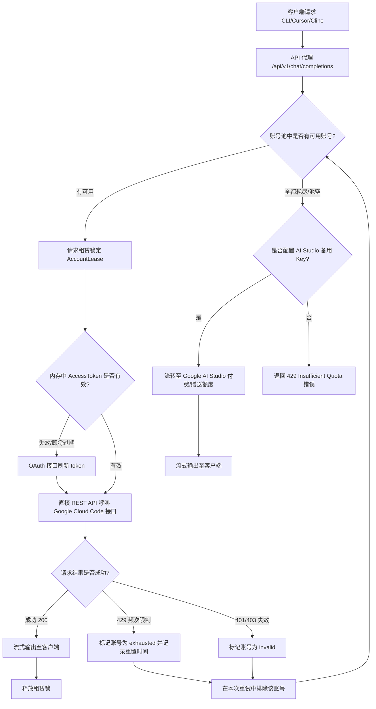

# 🌌 Antigravity Pool (Google/Gemini 账号流转代理池)

<p align="center">
  
  
  
  
  
</p>

这是一个专门为各类 AI 编程插件（如 **Cline**, **Cursor**, **Hermes** 等）定制的高并发 **Google/Gemini 账号流转代理池**。

传统的 Google API（特别是 Daily Preview 接口）存在极其严格的并发和频次限流。本项目通过将多个 Google 账号的并发限额合并为一个统一的 OpenAI 兼容端点，实现多账户间的高速流转与负载均衡，同时支持自动 Token 刷新及备用降级逻辑，从而为您提供不间断、零命令行开销的极速 API 体验。

---

## 🚀 系统架构与流转逻辑

以下是 Antigravity Pool 在接收到客户端请求时的处理和流转工作流：



---

## 🌟 核心特性

- ⚡ **超低延迟直连**：无需本地命令行代理中转，直接由 NextJS 服务器端向 Google API 发送 REST HTTP 请求，首字响应缩短至 **100-200ms**。
- 🔄 **原子化租赁锁控制**：使用 SQLite WAL (Write-Ahead Logging) 模式配合并发原子锁，多客户端高并发调用时能完美将请求分发到不同账号。
- 🔑 **自动凭证刷新**：利用 Google OAuth 2.0 接口在后台自动刷新 Access Token，无需扫码或频繁登录。
- 🛡️ **IP 安全拦截**：支持 `localhost`/`127.0.0.1` 环回连接免密访问，对公网/局域网远程管理时支持配置 `ADMIN_TOKEN` 拦截未授权操作，有效防御 Host 头部劫持。
- 📉 **AI Studio 降级备份**：当池内所有免费额度账号均耗尽 (429) 或失效时，支持自动无缝流转降级到备用的 Google AI Studio API Key（付费或赠送额度）。
- 🎨 **炫酷暗黑管理面板**：在 `/admin/dashboard` 提供极具未来感的暗黑系管理面板，实时查看账号活跃度、延迟、429 报错率，并支持一键导入与手动账号自检。

---

## ⚙️ 环境配置 (`.env`)

在项目根目录下创建 `.env` 文件，并根据您的网络和凭据进行配置：

```env
# SQLite 数据库路径
DATABASE_URL="file:./dev.db"

# Google OAuth 客户端配置（刷新 Google 账号 Access Token 必需）
GOOGLE_CLIENT_ID="your_google_oauth_client_id"
GOOGLE_CLIENT_SECRET="your_google_oauth_client_secret"

# 远程访问管理员面板的安全凭证（localhost/127.0.0.1 访问时会自动免密）
ADMIN_TOKEN="your_secure_admin_token"

# 本地调试代理（如果是大陆环境，需要配置 clash 等代理）
HTTP_PROXY="http://127.0.0.1:7897"
HTTPS_PROXY="http://127.0.0.1:7897"
NO_PROXY="localhost,127.0.0.1"

# 备用降级 Google AI Studio 密钥 (选填，当免费账号全部耗尽时使用)
FALLBACK_GEMINI_API_KEY="AIzaSy..."

# 流转池微调参数 (非必须，有默认值)
ANTIGRAVITY_POOL_TIMEOUT_MS=120000          # 请求超时时间
ANTIGRAVITY_POOL_ACCOUNT_LEASE_MS=180000     # 单个账号单次租赁最长时间 (ms)
ANTIGRAVITY_POOL_ACQUIRE_TIMEOUT_MS=15000     # 抢占账号租赁的等待超时时间 (ms)
ANTIGRAVITY_POOL_ACQUIRE_POLL_MS=100          # 抢占账户时的轮询间隔 (ms)
ANTIGRAVITY_POOL_SLOTS_PER_ACCOUNT=3         # 每个账号的并发通道数 (建议2-4)
ANTIGRAVITY_POOL_GLOBAL_SLOTS=12             # 全局并发上限通道数
```

---

## 🛠️ 快速启动指南

### 1. 安装项目依赖
请使用 Node.js `>=22.19.0`。当前依赖中的 `undici` 安全修复版本需要该运行时下限。

```bash
npm install
```

### 2. 准备环境配置
复制 `.env.example` 为 `.env`，然后填入 `GOOGLE_CLIENT_ID`、`GOOGLE_CLIENT_SECRET`，以及需要远程访问时的 `ADMIN_TOKEN`。

### 3. 初始化数据库
项目采用 Prisma ORM 配合 SQLite。请执行以下指令生成 Prisma 客户端：
```bash
npm run db:generate
```

### 4. 运行服务
* **开发模式**：
  ```bash
  npm run dev
  ```
* **生产模式 (推荐，性能更佳)**：
  ```bash
  npm run build
  ```
  ```bash
  npm run start
  ```

启动后，在浏览器中访问管理面板：
👉 **[http://localhost:18080/admin/dashboard](http://localhost:18080/admin/dashboard)**

默认启动脚本只监听 `127.0.0.1`，避免误把包含 refresh token 的管理面板暴露到局域网或公网。如果确实需要远程访问，请先配置高强度 `ADMIN_TOKEN`，再显式使用 `next dev -H 0.0.0.0 -p 18080` 或 `next start -H 0.0.0.0 -p 18080`。

### 5. 验证项目
提交或发布前建议运行：
```bash
npm run verify
```
该命令会依次执行 ESLint 与生产构建。

---

## 🔑 账户管理与登录

### 一键导入本地 Active 凭据（最简单）
如果您本地安装了 Google Cloud SDK 或 Cloud Code 插件，并且已经登录了 Google 账号。您只需在管理面板上点击 **“导入本地 Active 凭据”**，系统会自动读取 Windows 凭据管理器（`gemini:antigravity`）中缓存的 Token 并录入池中。

### 脚本自动捕获登录
您也可以运行项目中的登录脚本来授权新账号：
```bash
npm run login
```
该脚本会在本地 `8085` 端口拉起一个临时的 OAuth 接收服务并自动打开浏览器。在浏览器中选择您需要添加的 Google 账户进行授权，授权完毕后，Refresh Token 将被自动捕获并存入 SQLite 数据库。

### 查看账号状态
```bash
npm run accounts:view
```
该命令默认会脱敏 `refreshToken`。只有在私有终端中确实需要排查凭据原文时，才使用 `npm run accounts:view -- --show-secrets`。

---

## 💻 客户端配置示例

以 **Cline / Cursor / Hermes** 插件为例，在配置页面选择 **OpenAI-Compatible** (OpenAI 兼容模式)：

- **API URL (Base URL)**: `http://localhost:18080/api/v1`
- **API Key**: 任意填写（本地 localhost 环回访问会自动放行，如：`dummy`）
- **模型 (Model)**: 推荐填写以 `gemini-` 开头的模型。代理池会自动对不同的 OpenAI 模型请求进行翻译映射：

| 客户端请求模型 (示例) | 流转池实际调用模型 | 上游接口类型 | 上下文长度 | 最大输出 |
| :--- | :--- | :--- | :--- | :--- |
| `gemini-3.5-flash-high` | `gemini-3.5-flash-high` | Google Daily Preview | `1,048,576` | `65,536` |
| `gemini-3.5-flash-medium` | `gemini-3.5-flash-medium` | Google Daily Preview | `1,048,576` | `65,536` |
| `gemini-3.5-flash-low` / `gemini-1.5-flash` | `gemini-3.5-flash-low` | Google Daily Preview | `1,048,576` | `65,536` |
| `gemini-3.1-pro-high` / `gemini-1.5-pro` | `gemini-3.1-pro-high` | Google Daily Preview | `1,048,576` | `65,536` |
| `gemini-3.1-pro-medium` | `gemini-3.1-pro-medium` | Google Daily Preview | `1,048,576` | `65,536` |
| `gemini-3.1-pro-low` | `gemini-3.1-pro-low` | Google Daily Preview | `1,048,576` | `65,536` |
| `claude-3-5-sonnet` | `claude-sonnet-4-6` | Anthropic Vertex | `1,000,000` | `128,000` |
| `claude-3-opus` | `claude-opus-4-6-thinking` | Anthropic Vertex | `1,000,000` | `128,000` |

---

## 📂 项目结构

```txt
├── prisma/
│   ├── dev.db             # SQLite 数据库文件 (运行时生成)
│   └── schema.prisma      # Prisma 数据库结构
├── scripts/
│   ├── login.js           # 自动拉起浏览器进行 Google 账户授权并导入的脚本
│   ├── clean-cache.js     # 定时清理 NextJS Build 缓存
│   └── monitor-429.js     # 诊断数据库报错日志的独立脚本
├── src/
│   ├── app/
│   │   ├── admin/         # 管理面板视图
│   │   ├── api/           # API 端点路由 (completions, accounts 等)
│   │   └── page.tsx       # 极简 Landing 页面
│   ├── lib/
│   │   ├── antigravityPool.ts  # 流转池核心执行逻辑 (OAuth, 租赁抢占等)
│   │   ├── adminAuth.ts   # 管理端权限认证
│   │   └── prisma.ts      # Prisma Client 初始化及 SQLite wal 配置
│   └── proxy.ts           # 匹配器中间件
```

---

## 🛡️ 安全与隐私警告

1. **敏感凭据保护**：Prisma SQLite 数据库文件 `dev.db` 包含池内各账号的 `refreshToken`。此凭据拥有访问对应 Google 账号的权限。**请绝对不要将 `dev.db`、`.env` 或包含账号信息的日志提交到 Git 仓库或公开上传。**
2. **本地运行建议**：默认脚本已绑定 `127.0.0.1` 环回地址。如果需要部署到局域网或公网，**务必在 `.env` 中设置高强度的 `ADMIN_TOKEN`**，并确认反向代理正确传递客户端来源信息，以防账号池管理页面被恶意扫描和盗用。
