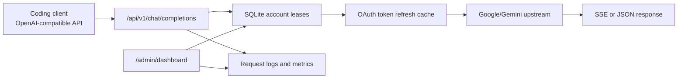

# Antigravity Pool

> Local OpenAI-compatible proxy for rotating Google/Gemini account capacity.

[](https://github.com/Hephaestus-DevKit/antigravity-pool/actions/workflows/ci.yml)


Antigravity Pool is a local-first service that exposes an OpenAI-compatible API and routes requests across a pool of Google/Gemini accounts. It is built for developer tools that can speak the OpenAI API shape, such as Cline, Cursor, and similar coding clients.

This is not a static website and it is not intended to run on GitHub Pages. The working product is the local Next.js service, the API routes, the dashboard, and the SQLite-backed account pool.

## What It Does

- Serves an OpenAI-compatible endpoint at `http://localhost:18080/api/v1`
- Maps common OpenAI/Gemini/Claude-style model IDs to the upstream daily companion models
- Rotates active accounts through SQLite-backed lease slots
- Refreshes Google OAuth access tokens from stored refresh tokens
- Streams chat completions back to OpenAI-compatible clients
- Tracks request logs, latency, 429 rates, account health, and quota status
- Provides a local admin dashboard at `/admin/dashboard`
- Optionally falls back to a Google AI Studio API key when the account pool is empty or exhausted

## When To Use It

Use this project when you actually need a local account pool:

- You run multiple Google/Gemini accounts for coding assistants.
- Your clients require an OpenAI-compatible base URL.
- You need account health checks, lease control, and quota visibility.
- You are comfortable keeping OAuth refresh tokens in a local SQLite database.

Do not use it if a single official API key or hosted provider already solves the problem. This service adds operational responsibility and should stay private or tightly controlled.

## Architecture



The runtime data layer uses Node.js built-in `node:sqlite` with SQLite WAL enabled. Prisma is kept as a schema validation aid, but request handling does not depend on Prisma's native query engine. This keeps the project usable on Windows ARM64 and standard x64 environments without platform-specific Prisma engine failures.

## Requirements

- Node.js `>=22.19.0`
- npm
- Google OAuth client credentials
- Local `.env`
- Optional: Google AI Studio API key for fallback

## Setup

Install dependencies:

```bash
npm install
```

Create `.env` from the example:

```bash
cp .env.example .env
```

Configure at least:

```env
DATABASE_URL="file:./dev.db"
GOOGLE_CLIENT_ID="your_google_oauth_client_id"
GOOGLE_CLIENT_SECRET="your_google_oauth_client_secret"
ADMIN_TOKEN="use_a_strong_token_if_exposed_beyond_localhost"
```

Optional fallback:

```env
FALLBACK_GEMINI_API_KEY="your_ai_studio_key"
```

## Run Locally

Development server:

```bash
npm run dev
```

Production mode:

```bash
npm run build
npm run start
```

Open the dashboard:

```text
http://localhost:18080/admin/dashboard
```

The default scripts bind to `127.0.0.1`. Keep it that way unless you have a clear reason to expose the service. If you bind to `0.0.0.0`, set a strong `ADMIN_TOKEN` first.

## Client Configuration

Use an OpenAI-compatible provider configuration:

```text
Base URL: http://localhost:18080/api/v1
API Key:  dummy
Model:    gemini-3.5-flash-low
```

Localhost admin access is allowed without `ADMIN_TOKEN`; remote access is not.

## Account Management

Import the active local credential from the dashboard:

```text
/admin/dashboard -> 导入本地 Active 凭据
```

Or run the OAuth login helper:

```bash
npm run login
```

View stored accounts with masked refresh tokens:

```bash
npm run accounts:view
```

Monitor recent 429 pressure:

```bash
npm run monitor:429
```

## Verification

Run the full local gate before pushing:

```bash
npm run verify
```

This runs:

- ESLint
- TypeScript type checking
- Prisma schema validation
- Next.js production build

Security audit:

```bash
npm audit --audit-level=high
```

## Project Layout

```text
prisma/
  schema.prisma          Prisma schema validation source
scripts/
  local-db.js            Node SQLite helper for CLI scripts
  login.js               OAuth login and account import helper
  monitor-429.js         Recent request log monitor
  validate-prisma.js     Cross-platform Prisma schema validation
  view-accounts.js       Masked account inspection
src/
  app/
    admin/               Dashboard UI
    api/                 OpenAI-compatible and admin API routes
  lib/
    adminAuth.ts         Admin access checks
    antigravityPool.ts   Upstream request, token, quota, and lease logic
    modelCatalog.ts      Public model catalog and metadata
    prisma.ts            Node SQLite runtime data layer
```

## Security Notes

- `dev.db` can contain Google OAuth refresh tokens. Never commit it.
- `.env` can contain OAuth secrets and fallback API keys. Never commit it.
- Do not expose the dashboard without `ADMIN_TOKEN`.
- Treat logs carefully; upstream errors may include account or quota details.
- Keep this service local or behind trusted infrastructure.

## Deployment

This project should be deployed as a Node.js service, not as static hosting. GitHub Pages is intentionally not used because it cannot run API routes, OAuth refresh, SQLite, or the account dashboard backend.

### Docker (recommended for a server)

The repository includes a production Docker image, a persistent SQLite volume, and
a liveness endpoint at `/api/health`. Build and start it on a trusted host:

```bash
cp .env.example .env
# Fill in GOOGLE_CLIENT_ID, GOOGLE_CLIENT_SECRET, and a strong ADMIN_TOKEN.
docker compose up -d --build
```

The included Compose file publishes only to `127.0.0.1:18080`; put an
authenticated reverse proxy in front of it if remote access is required. Keep the
named volume: it contains the SQLite database and OAuth refresh tokens.

Each successful push to `main` also publishes `ghcr.io/hephaestus-devkit/antigravity-pool:latest`
and an immutable `sha-...` tag. Pull a published image with:

```bash
docker pull ghcr.io/hephaestus-devkit/antigravity-pool:latest
```

Publishing an image is intentionally separate from rollout: this project has no
configured production host, secrets store, or persistent volume outside this
repository. Configure those before exposing the service beyond localhost.
